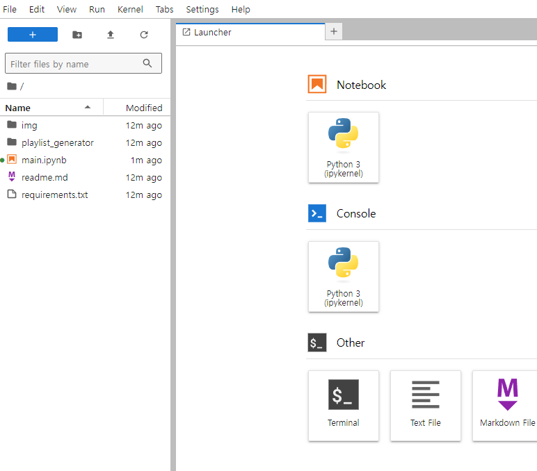
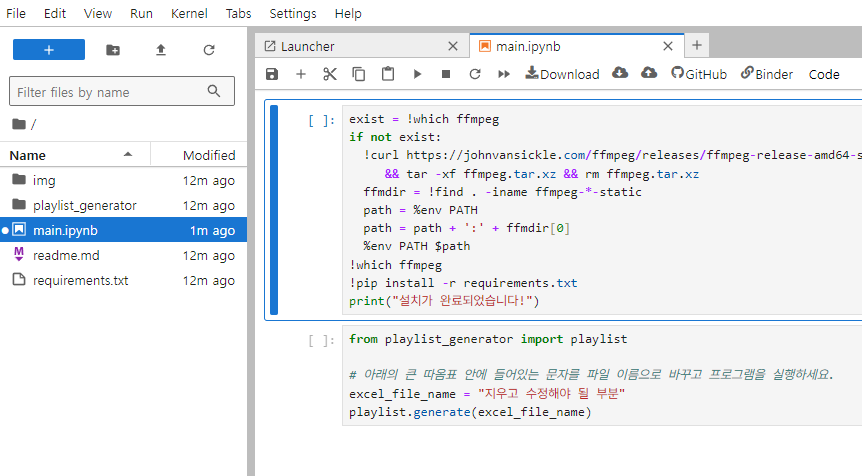
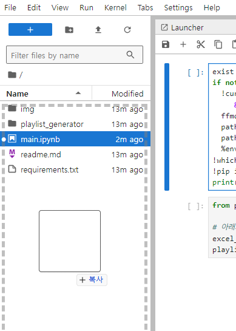
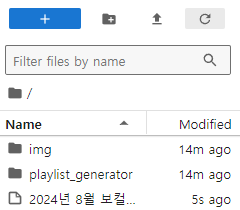
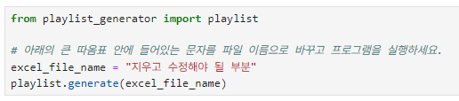
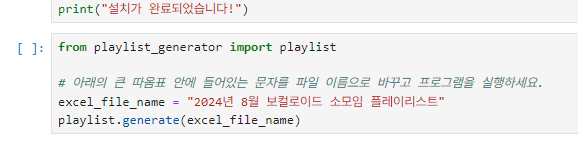
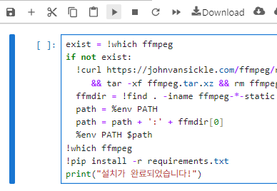
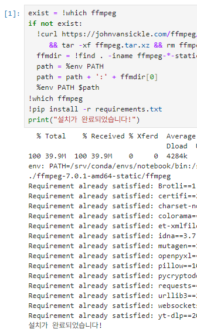
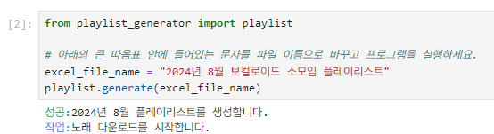
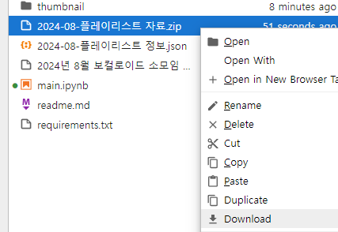

플레이리스트 자료를 다운로드 할 수 있는 곳입니다.

# 사용법

1. 위의 **launch binder**라고 되어있는 이미지를 클릭해서 사이트에 접속합니다. 완전히 접속하는데까지 로딩화면이 뜨면서 시간이 약간 걸릴 수도 있습니다.
2. 접속하면 아래와 같은 화면이 나오는데, 화면 좌측의 **main.ipynb** 파일을 더블 클릭해서 열어주세요.  
     
   
3. 그런 다음 다운로드 한 엑셀파일을 우측에 드래그해서 업로드 해주세요.
4. 파일이 정상적으로 업로드 되었다면 아래와 같이 화면 우측에 표시될 겁니다. 만약 표시되지 않았다면 화면 상단의 **⟳** 표시의 새로고침 아이콘을 클릭해서 파일이 업로드 되었는지 확인하세요.  
     
   
5. 화면의 가운데로 이동해서 큰 따옴표 안의 **지우고 수정해야 될 부분**의 글씨를 지우고 업로드 한 엑셀 파일의 이름으로 바꿔주세요.  
     
   
6. 화면 중간의 첫번째 박스 부분을 아래 사진처럼 선택해주고 사진에 보이는 **▶** 버튼을 클릭해서 코드를 실행해주세요. 박스 아래에 설치가 완료되었습니다! 라는 글자가 뜨면 전부 실행이 완료되었다는 의미입니다.  
     
   
7. 두번째 박스도 선택 후 동일하게 **▶** 버튼을 클릭해서 코드를 실행해주세요. 이때 박스 아래에 메세지가 뜨면서 자료가 만들어지는 과정을 알려줄겁니다.  
   
8. 만약 자료가 정상적으로 생성되었다면 생성된 자료 이름을 알려주는데, 화면 좌측에서 그 자료를 우클릭하고 **Download**를 선택해서 다운로드를 하면 됩니다.  
     
   
9. 자료가 정상적으로 생성되지 않았다면 다시 다운로드 하라는 경고문이 뜨는데, 이 경우에는 7번을 다시 실행해주세요.  
   
10. 여러 번 실행했는데도 경고문이 뜨는 경우에는 엑셀 파일에서 오류가 있는지 확인하거나 아예 사이트를 나간 다음 다시 제일 위쪽의 링크를 클릭해서 처음부터 다시 순서를 정확하게 따라서 실행해주세요.
